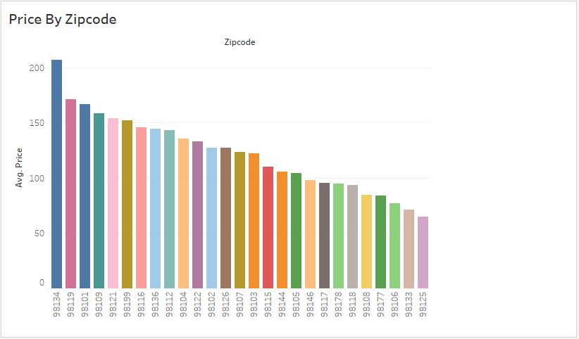
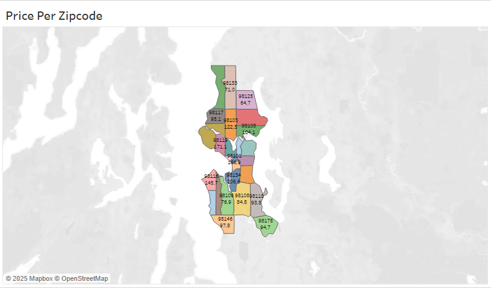
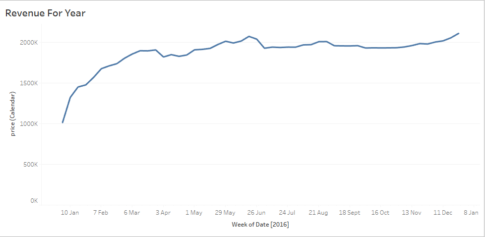
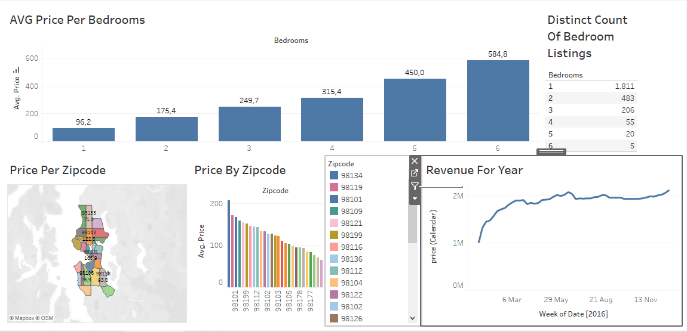

# 📊 Airbnb Data Visualization Project (Tableau)

Proyek ini merupakan bagian dari pelatihan **Data Analyst** yang saya ikuti bersama **Alex The Analyst**.  
Analisis dilakukan menggunakan **Tableau** dengan dataset publik dari **Kaggle** yang berisi data listing Airbnb tahun 2016.

---

## 📂 Sumber & Referensi

- 🎓 **Pelatihan (YouTube):** [Tableau Full Project – Alex The Analyst](https://www.youtube.com/watch?v=zOR0-nygfDE&list=PLUaB-1hjhk8FE_XZ87vPPSfHqb6OcM0cF&index=32)  
- 📊 **Dataset (Kaggle):** [Airbnb Listings 2016 Dataset – Alexander Freberg](https://www.kaggle.com/datasets/alexanderfreberg/airbnb-listings-2016-dataset)

---

## 🗂 Dataset

Dataset ini mencakup informasi berikut:

- 💰 Harga sewa (`price`)
- 🏘 Jumlah listing
- 🛏 Jumlah kamar tidur (`bedrooms`)
- 📍 Lokasi (`zipcode`)
- 📅 Tanggal listing (`date`)

---

## 🎯 Tujuan Analisis

1. Menganalisis harga sewa berdasarkan jumlah kamar dan lokasi.  
2. Mengidentifikasi distribusi jumlah listing di berbagai area.  
3. Mengestimasi potensi pendapatan per listing.  
4. Mengamati tren performa listing berdasarkan waktu.  

---

## 🛠 Tools yang Digunakan

| Tools | Fungsi |
|-------|--------|
| 🧩 **Tableau** | Visualisasi data & pembuatan dashboard |
| 📑 **Excel / CSV** | Pembersihan & pengolahan data awal |
| 📂 **Kaggle** | Sumber dataset publik |

---

## 📈 Insight yang Ditemukan

- Harga sewa **bervariasi signifikan** berdasarkan jumlah kamar dan lokasi.  
- Area tertentu menunjukkan **konsentrasi listing yang lebih tinggi**.  
- Potensi pendapatan dapat **diprediksi melalui kombinasi variabel** jumlah kamar dan kode pos (zipcode).  

---

## 📸 Preview Visualisasi

  
  

  
  

---

## 📜 Lisensi

Proyek ini **hanya digunakan untuk tujuan pembelajaran** dan **tidak memiliki afiliasi resmi dengan Airbnb**.

---

## ✍️ Author

**ricki309**  
💼 *Data Analyst Portfolio Project*  
🔗 [LinkedIn](https://www.linkedin.com) *(tambahkan link jika ada)*

